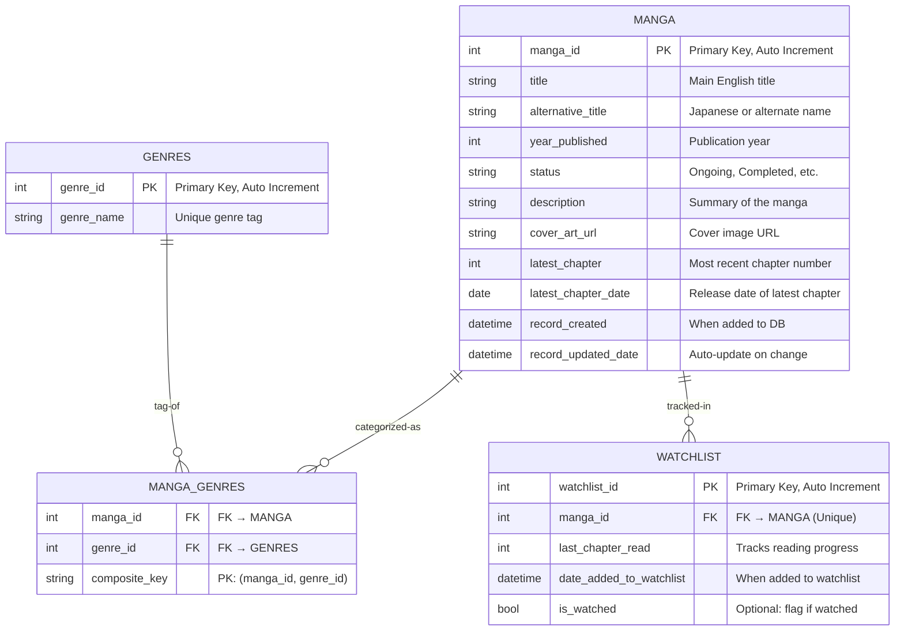

# MTurtleBase

A full-stack application for organizing and tracking your manga collection with additional data from the MangaDex API.

## Features

### Core Functionality
- 📚 **Manga Management**  
  - Manually add, Edit, Delete manga entries  
  - Track reading progress (Last chapter read, Status)  

- 🔍 **Advanced Search**  
  - Filter by genres (Action, Romance, Isekai, etc.)
  - Create custom genres 
  - Search by title and chapter count  
  - Sort by criterias

- 🛠 **Database Features**  
  - PostgreSQL relational database  
  - Optimized queries with indexing  
  - Automatic timestamp tracking

- **Responsive UI**  
  - Built with React, Material UI, and Bootstrap
    
## Tech Stack

### Frontend
- React.js with Hooks  
- Material UI (MUI) Components  
- Axios for API calls  
- CSS Modules for styling  

### Backend
- Node.js + Express.js  
- PostgreSQL Database  
- RESTful API endpoints

### Database:
- Supabase

### APIs
- [MangaDex API](https://api.mangadex.org/docs/) - Primary manga data source  

## Database Schema

### Soon To Come Features:

### Features

- 📚 **Manga Management**
  - Autofill add manga form after entering a title by the use of MangaDex API
  - Connect the Search bar with the MangaDex API to search for manga outside of the database
    - For viewing outside source manga information
    - For another method of adding manga
  - Rating system

- 🔍 **Advanced Search**
  - Sort by type of literature (Manga, Manwha, Manhua)
  - 
 
  
- **Responsive UI**
  - 100% Mobile-friendly design (Currently not 100%)

- ### Technical Highlights
- **Real-time Data Sync**  
  - Integrated with MangaDex API  
  - Automatic chapter updates 

